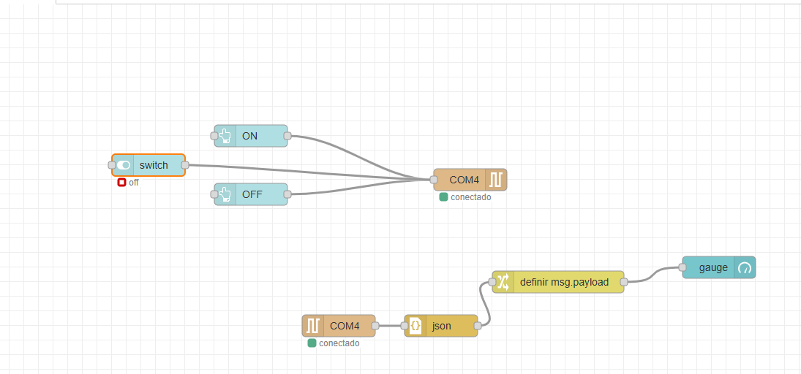

# Sensor de proximidade e Led ON/OFF serial input

Utilizamos o `node-red` para criar o dashboard e poder criar os botões responsaveis por ligar e desligar o led
*Lembre de instalar as bibliotecas no IDE*
no cmd basta digitar o comando 

```cmd
    node-red
```

ao gerar tudo correto basta ir para a porta  e seguir os nossos passos:


