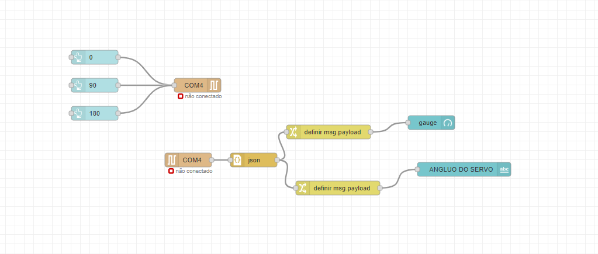
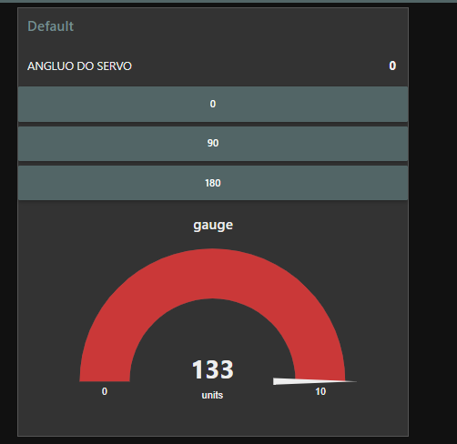
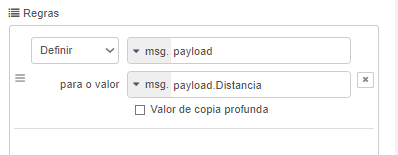

# Aula 4 - sensor proximidade + Servo motor

Serial out -> angulo do servo
quando o usuario enviar "90" o motor tem que rotacionar para "90", fazendo isso para 0º e 180º

Serial In -> Graficos que pegam o valor do objeto `json`

```json
    {
        "Distancia":"",
        "Angulo_Servo":""
    }
```





<br/>
Lembre de adicionar esse parametro na tag `change` visto que tem que passar a msg.payload.CHAVE_JSON

